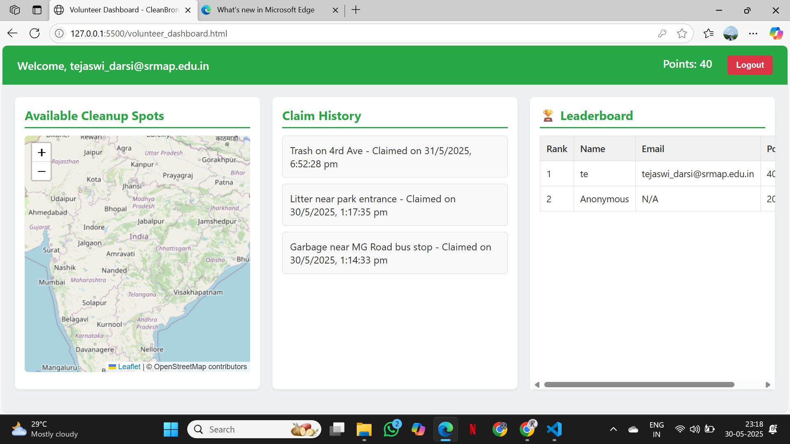

# CleanBronx – Map. Claim. Clean.

**CleanBronx** is a community-driven web platform designed to empower volunteers in keeping their neighborhoods clean. Volunteers can view cleanup reports on a live map, claim spots to clean, and earn points on a leaderboard — all in real-time.

---

## 🚀 Features

- 🔐 Secure login/signup for both **users** and **volunteers**
- 🗺️ Interactive map displaying all unclaimed cleanup spots (via Leaflet.js + Firebase)
- ✅ Volunteers can **claim** reports and earn **points**
- 📜 Claim history tracking for accountability
- 🏆 Real-time **leaderboard** for gamified recognition
- 🎯 Clean, responsive frontend UI

---

## 📸 Screenshots

  


---

## 🔧 Built With

- **HTML, CSS, JavaScript**
- **Firebase Authentication**
- **Firebase Firestore**
- **Leaflet.js** (for map display)
- **Google Maps API** *(optional for future enhancement)*

---

## 🛠️ Project Structure

```
📁 cleanbronx-map-claim-clean/
├── index.html                 # Homepage
├── user_signup.html          # User registration page
├── user_login.html           # User login page
├── user_dashboard.html       # User dashboard
├── volunteer_signup.html     # Volunteer registration page
├── volunteer_login.html      # Volunteer login page
├── volunteer_dashboard.html  # Volunteer dashboard with map
└── README.md                 # You're here!
```

---

## 🧩 Firebase Configuration

You’ll need to set up your own Firebase project to use this app.

Add the following configuration in your HTML files inside a `<script>` tag:

```js
const firebaseConfig = {
  apiKey: "YOUR_API_KEY",
  authDomain: "YOUR_PROJECT.firebaseapp.com",
  projectId: "YOUR_PROJECT_ID",
  storageBucket: "YOUR_PROJECT.appspot.com",
  messagingSenderId: "SENDER_ID",
  appId: "APP_ID"
};

firebase.initializeApp(firebaseConfig);
```

---

## 💡 Inspiration

This project was built for a **social impact hackathon**.

We were inspired by the problem of unreported or ignored trash in local neighborhoods. With CleanBronx, we aimed to create a **fun, rewarding, and impactful** platform for volunteers to take initiative in their communities.

---

## 😅 Challenges Faced

- Syncing real-time map data with Firebase
- Managing user vs. volunteer roles securely
- Keeping the UI clean and responsive
- Handling multiple users updating the same location in real-time

---

## 🙌 What We Learned

- Firebase Authentication & Firestore integration
- Real-time data updates and conflict resolution
- Map implementation using Leaflet.js
- Building a user-friendly dashboard from scratch

---

## 📬 Contact

Made with ❤️ for the community.

Have questions or feedback? Reach out via [GitHub Issues](https://github.com/your-username/your-repo/issues) or email.
